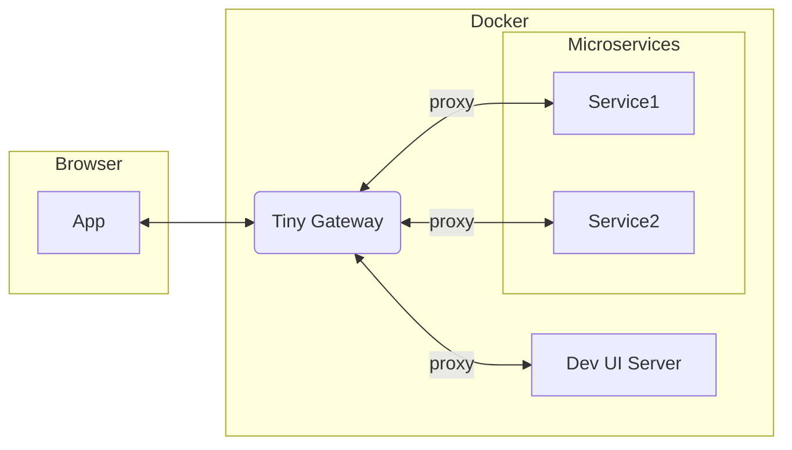

# Tiny Gateway

Tiny Gateway is a lightweight API gateway for multi-tenant development environments.
It handles authentication, role-based authorization for proxied routes, and forwards tenant context to backend services.



## Development-Only Use

This project is intended for development and testing environments, not production.

## Quick Start (Recommended): Docker + Your Own `config.yml`

1. Build the image:
   ```bash
   docker build -t tiny-gateway:local .
   ```

2. Start from a sample config (or use your own file):
   ```bash
   cp sample-configs/basic-single-tenant.yml ./my-gateway.yml
   ```

3. Run Tiny Gateway with your config mounted as a single file:
   ```bash
   docker run --rm -p 8000:8000 \
     -e CONFIG_FILE=/app/config/runtime.yml \
     -e SECRET_KEY=dev-secret-key-change-me \
     -e ACCESS_TOKEN_EXPIRE_MINUTES=30 \
     -e LOG_LEVEL=INFO \
     -v "$(pwd)/my-gateway.yml:/app/config/runtime.yml:ro" \
     tiny-gateway:local
   ```

4. Verify service is up:
   ```bash
   curl http://localhost:8000/health
   ```

## Docker Compose (Fastest Repo Workflow)

`docker-compose.yml` expects `./config/config.yml`, so the simplest path is:

1. Put your config at `config/config.yml`:
   ```bash
   cp sample-configs/multi-tenant-rbac.yml ./config/config.yml
   ```

2. Start:
   ```bash
   docker compose up --build
   ```

3. Verify:
   ```bash
   curl http://localhost:8000/health
   ```

4. Stop:
   ```bash
   docker compose down
   ```

## Sample Configs

Use these files in `/sample-configs` as starting points:

- `basic-single-tenant.yml`: one tenant, one admin, one upstream
- `multi-tenant-rbac.yml`: multiple tenants with role-scoped access
- `path-rewrite.yml`: endpoint prefix rewrite to a different upstream path
- `multi-upstream.yml`: multiple endpoints routed to different services
- `wildcard-admin.yml`: wildcard resource/action role for broad access

## Key Capabilities

- Issues JWT access tokens via `POST /api/v1/auth/login`
- Exposes current-user info via `GET /api/v1/users/me`
- Enforces RBAC on proxied routes using configured roles and permissions
- Enforces tenant/role binding: token claims must match current configured user state
- Proxies matched routes to configured upstream targets
- Supports path rewrite and host header rewriting per proxy rule
- Adds `X-Tenant-ID` to proxied requests
- Loads configuration from YAML (`CONFIG_FILE`) with packaged defaults when `CONFIG_FILE` is not set

## Configuration Reference

Configuration file schema:

```yaml
tenants:
  - id: tenant-a

users:
  - name: alice
    password: pass123
    tenant_id: tenant-a
    roles: [editor]

roles:
  editor:
    - resource: reports
      actions: [read, create, update]

proxy:
  - endpoint: /api/reports
    target: http://reports-api:9000/
    rewrite: ""
    change_origin: true
    resource: reports   # optional; overrides inferred resource name
```

### Passwords

User `password` supports:

- plaintext (simple dev setup)
- bcrypt hash (recommended for shared dev environments)

### Proxy Matching and Rewrite

- Proxy matching is prefix-based against `proxy[].endpoint`
- If multiple entries match, the most-specific endpoint wins
- `rewrite: ""` keeps the external path prefix
- `rewrite: "/new-prefix"` replaces the endpoint prefix with `/new-prefix`
- `change_origin: true` rewrites `Host` to the upstream host

### RBAC Mapping for Proxied Requests

- `GET`, `HEAD`, `OPTIONS` -> `read`
- `POST` -> one of `create`, `write`, `execute`
- `PUT`, `PATCH` -> one of `update`, `write`
- `DELETE` -> one of `delete`, `write`

Permission matching behavior:

- `resource: "*"` matches any resource
- action `"*"` matches any action
- if `proxy[].resource` is set, that is used for RBAC resource checks
- otherwise, resource is inferred from the endpoint tail segment

### Tenant and Role Binding

On authenticated requests, token claims are re-validated against current configured users:

- `sub` user must still exist
- token `tenant_id` must equal configured user tenant
- token roles must match configured user roles

If any check fails, the request is rejected.

## API Endpoints

- `POST /api/v1/auth/login`
  - OAuth2 password form (`username`, `password`)
  - returns `{"access_token":"...","token_type":"bearer"}`
- `GET /api/v1/users/me`
  - requires `Authorization: Bearer <token>`
- `GET /health`
- `GET /test_login`
- `GET /docs`

## Example Auth Flow

1. Get token:
   ```bash
   curl -X POST http://localhost:8000/api/v1/auth/login \
     -H 'Content-Type: application/x-www-form-urlencoded' \
     -d 'username=admin&password=admin123'
   ```

2. Call authenticated endpoint:
   ```bash
   curl http://localhost:8000/api/v1/users/me \
     -H "Authorization: Bearer <access_token>"
   ```

## Environment Variables

- `CONFIG_FILE`: YAML config path
- `SECRET_KEY`: JWT signing key
- `ACCESS_TOKEN_EXPIRE_MINUTES`: token lifetime in minutes
- `LOG_LEVEL`: `DEBUG|INFO|WARNING|ERROR|CRITICAL`
- `HOST`: runtime host for CLI entrypoint
- `PORT`: runtime port for CLI entrypoint
- `RELOAD`: enables auto-reload for CLI entrypoint (`1`, `true`, `yes`)

## Optional Local Run (No Docker)

```bash
uv sync --group dev
uv run uvicorn tiny_gateway.main:app --reload
```
