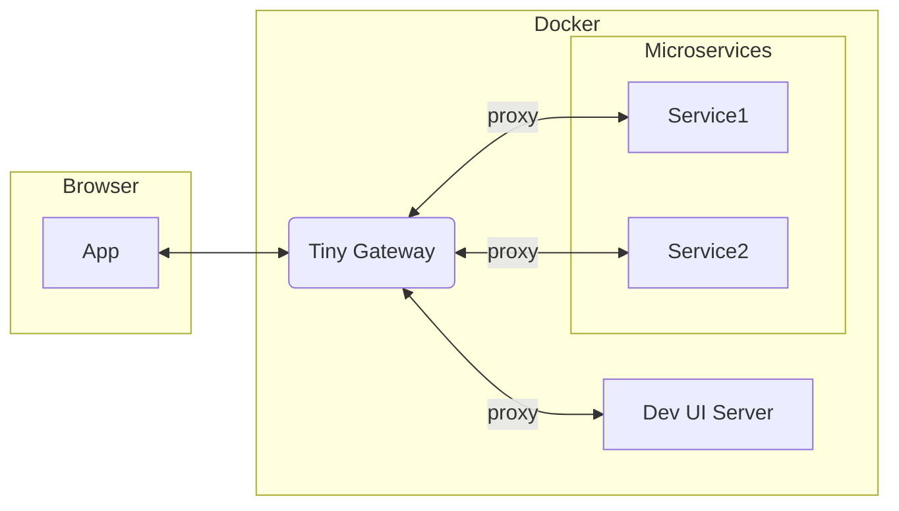

# Tiny Gateway

A lightweight API gateway for multi-tenant microservice development environments. Handles JWT authentication, role-based authorization, and request proxying with tenant isolation.



## ⚠️ Development Use Only
This service is designed exclusively for development and testing environments. Do not deploy to production.

## What It Does

- Authenticates users via JWT tokens containing tenant and role information
- Enables role-based access control (RBAC) 
- Proxies authenticated requests to backend services with tenant context
- Maintains tenant isolation across all operations
- Configured entirely through YAML files

## Prerequisites

- Docker and Docker Compose

## Getting Started

1. **Clone the repository**
   ```bash
   git clone <repository-url>
   cd tiny-gateway
   ```

2. **Configure the service**
   Edit `config/config.yml` to set up your routes, users, and permissions.

3. **Start the gateway**
   ```bash
   docker-compose up --build
   ```
   
   The gateway will be available at `http://localhost:8000`. The test login page is available at `/test_login`.

## Multi-Tenant Architecture

The API Gateway supports multi-tenancy, where each user is associated with a single tenant. This provides logical isolation between different tenants' data and operations.


### Configuration

Edit `config.yml` to configure:

- **Tenants**: Define your tenant IDs
  ```yaml
  tenants:
    - id: tenant-1
    - id: tenant-2
  ```

- **Users**: Assign users to specific tenants
  ```yaml
  users:
    - name: user1
      password: pass123
      roles: [user]
      tenant_id: tenant-1  # Required field
  ```

- **Roles**: Define permissions per tenant
  ```yaml
  roles:
    admin:
      - resource: "*"
        actions: [read, write, create, delete]
    user:
      - resource: "data"
        actions: [read]
  ```

- **Proxies**: Configure request routing to backend services
  ```yaml
  proxy:
    - endpoint: /api/data
      target: http://backend-service/
      rewrite: /data
      change_origin: true  # If true, updates the Host header to match target
  ```

  The proxy will forward requests from `{endpoint}/*` to `{target}{rewrite}/*` by replacing the endpoint prefix.
  If `rewrite` is omitted or empty, the original request path is preserved.
  For example, request `/api/data/items`:
  - with `rewrite: /data` => `http://backend-service/data/items`
  - with `rewrite: ""` => `http://backend-service/api/data/items`

### Tenant ID in JWT Tokens

Each JWT token includes the user's `tenant_id` in its payload. Backend services can use this to enforce tenant isolation at the data access layer.

Example JWT payload:
```json
{
  "sub": "username",
  "roles": ["user"],
  "tenant_id": "tenant-1",
  "exp": 1234567890
}
```

### HTTP Headers to Backend Services

The gateway forwards tenant information to backend services via HTTP headers:

- **`X-Tenant-ID`**: Contains the tenant ID from the JWT token, enabling backend services to enforce tenant isolation

Note: Role information is currently only available in the JWT token itself. Backend services should decode the JWT to access role information for authorization decisions.

Example configuration:

```yaml
users:
  - name: admin
    password: adminpass
    roles: [admin]
    tenant_id: test-tenant

roles:
  admin:
    - resource: "*"
      actions: [read, write, create, delete]

proxy:
  - endpoint: /api/service
    target: http://localhost:3000
    rewrite: ""
    change_origin: true
```

## Configuration

The gateway is configured through `config/config.yml`. Key sections:

- **tenants**: Define tenant IDs
- **users**: Define users with passwords, roles, and tenant assignments  
- **roles**: Define permissions for resources and actions
- **proxy**: Define endpoint-to-backend routing rules

See the example configuration in `config/config.yml` for the complete structure.

## API Endpoints

- `POST /api/v1/auth/login` - Obtain JWT token with tenant context
- `GET /api/v1/users/me` - Get current user information including tenant ID

## Running Tests

Using the Makefile (recommended):
```bash
make test-unit         # Run unit tests only
make test-integration  # Run integration tests only  
make test-all          # Run all tests
```

Or with Docker:
```bash
docker-compose exec tiny-gateway pytest tests/ -v
```

## Development Without Docker

If you prefer to run without Docker:

### Prerequisites
- Python 3.13+
- uv package manager (recommended) or pip

### Setup
1. Install dependencies:
   ```bash
   uv sync
   ```

2. Run the service:
   ```bash
   uv run uvicorn tiny_gateway.main:app --reload
   ```
   or
   ```bash
   uv run tiny-gateway
   ```

### Environment Variables
- `CONFIG_FILE`: Path to configuration file (default: packaged `tiny_gateway/resources/default_config.yml`)
- `SECRET_KEY`: JWT signing key (default: development key)  
- `ACCESS_TOKEN_EXPIRE_MINUTES`: Token expiration time (default: 30)

## Project Structure

```
.
├── tiny_gateway/                      # Application code
│   ├── api/                  # API routes
│   ├── core/                 # Core functionality
│   ├── models/               # Data models
│   └── config/               # Configuration
├── tests/                    # Test files
├── config/                   # Configuration files
└── main.py                  # Application entry point
```
