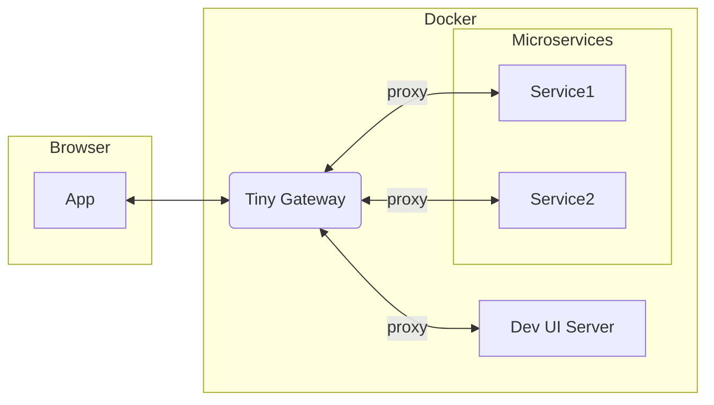

# Tiny Gateway

Tiny Gateway is a lightweight API gateway for multi-tenant development environments.
It handles authentication, role-based authorization for proxied routes, and forwards tenant context to backend services.



## Development-Only Use

This project is intended for development and testing environments, not production.

## Key Capabilities

- Issues JWT access tokens via `POST /api/v1/auth/login`
- Exposes current-user info via `GET /api/v1/users/me`
- Enforces RBAC on proxied routes using configured roles and permissions
- Enforces tenant/role binding: token claims must match the current configured user
- Proxies matched routes to configured upstream targets
- Supports path rewrite and host header rewriting per proxy rule
- Adds `X-Tenant-ID` to proxied requests
- Loads configuration from YAML (`CONFIG_FILE`) with packaged defaults for quick startup

## Prerequisites

- Docker and Docker Compose (for containerized run)
- Python 3.13+ and `uv` (for local run)

## Run with Docker Compose

1. Configure the gateway:
   - Edit `config/config.yml` for your tenants, users, roles, and proxy targets.

2. Start the service:
   ```bash
   docker compose up --build
   ```

3. Verify:
   ```bash
   curl http://localhost:8000/health
   ```

4. Optional helper endpoints:
   - `http://localhost:8000/test_login` (simple login page)
   - `http://localhost:8000/docs` (OpenAPI UI)

5. Stop the stack:
   ```bash
   docker compose down
   ```

## Run with Docker (Single Container)

1. Build the image:
   ```bash
   docker build -t tiny-gateway:local .
   ```

2. Run with your local config mounted:
   ```bash
   docker run --rm -p 8000:8000 \
     -e CONFIG_FILE=/app/config/config.yml \
     -e SECRET_KEY=dev-secret-key-change-me \
     -e ACCESS_TOKEN_EXPIRE_MINUTES=30 \
     -e LOG_LEVEL=INFO \
     -v "$(pwd)/config:/app/config:ro" \
     tiny-gateway:local
   ```

3. Verify:
   ```bash
   curl http://localhost:8000/health
   ```

Note: If `CONFIG_FILE` is not set, the app loads packaged `tiny_gateway/resources/default_config.yml`.

## Configuration Reference

Primary configuration is YAML (typically `config/config.yml`):

```yaml
tenants:
  - id: tenant-1
  - id: tenant-2

users:
  - name: alice
    password: pass123          # plaintext or bcrypt hash
    tenant_id: tenant-1
    roles: [editor]

roles:
  editor:
    - resource: graphs
      actions: [create, read, update, delete, execute]

proxy:
  - endpoint: /api/v1/graph
    target: http://graph-composer:8000/
    rewrite: ""
    change_origin: true
    resource: graphs           # optional RBAC resource override
```

### Proxy Behavior

- Request matching is prefix-based against `proxy[].endpoint`
- Most-specific endpoint wins when multiple entries match
- Path rewrite behavior:
  - `rewrite: ""` keeps the endpoint path prefix
  - `rewrite: "/new-prefix"` replaces endpoint prefix with `/new-prefix`
- If `change_origin: true`, `Host` is rewritten to the upstream target host

### RBAC Action Mapping for Proxied Requests

- `GET`, `HEAD`, `OPTIONS` -> requires `read`
- `POST` -> requires one of `create`, `write`, `execute`
- `PUT`, `PATCH` -> requires one of `update`, `write`
- `DELETE` -> requires one of `delete`, `write`

Permission matching details:

- `resource: "*"` matches any proxied resource
- action `"*"` matches any action
- `proxy[].resource` (if set) is used for RBAC checks; otherwise the resource is inferred from the endpoint tail segment

### Token Validation and Tenant Binding

On authenticated requests, token claims are validated and bound to current config state:

- user (`sub`) must still exist
- token `tenant_id` must match configured user tenant
- token roles must match configured user roles

If any of these checks fails, the request is rejected.

## API Endpoints

- `POST /api/v1/auth/login`
  - OAuth2 password flow form fields (`username`, `password`)
  - returns `{ "access_token": "...", "token_type": "bearer" }`
- `GET /api/v1/users/me`
  - requires `Authorization: Bearer <token>`
  - returns username, roles, tenant_id
- `GET /health`
  - service health endpoint
- `GET /test_login`
  - serves packaged login HTML page

### Example Authentication Flow

1. Get a token:
   ```bash
   curl -X POST http://localhost:8000/api/v1/auth/login \
     -H 'Content-Type: application/x-www-form-urlencoded' \
     -d 'username=paul&password=cleverpass123'
   ```

2. Use the token:
   ```bash
   curl http://localhost:8000/api/v1/users/me \
     -H "Authorization: Bearer <access_token>"
   ```

## Local Development (Without Docker)

1. Install dependencies:
   ```bash
   uv sync --group dev
   ```

2. Run the service:
   ```bash
   uv run uvicorn tiny_gateway.main:app --reload
   ```
   or
   ```bash
   uv run tiny-gateway
   ```

3. Run tests:
   ```bash
   make test-unit
   make test-integration
   make test-all
   ```

## Environment Variables

- `CONFIG_FILE`: YAML config file path
- `SECRET_KEY`: JWT signing key
- `ACCESS_TOKEN_EXPIRE_MINUTES`: token lifetime in minutes
- `LOG_LEVEL`: logger level (`DEBUG`, `INFO`, `WARNING`, `ERROR`, `CRITICAL`)
- `HOST`: runtime host for CLI entrypoint (`tiny-gateway`)
- `PORT`: runtime port for CLI entrypoint
- `RELOAD`: enables reload for CLI entrypoint when set to `1`, `true`, or `yes`

## Project Structure

```text
.
├── tiny_gateway/            # Python package
│   ├── api/                 # API routers and endpoint handlers
│   ├── core/                # Security and proxy middleware
│   ├── models/              # Pydantic config and API schemas
│   ├── resources/           # Packaged default config and login page
│   └── main.py              # App factory and runtime entrypoint
├── config/                  # Example runtime configuration
├── tests/                   # Unit and integration tests
├── Dockerfile
└── docker-compose.yml
```
