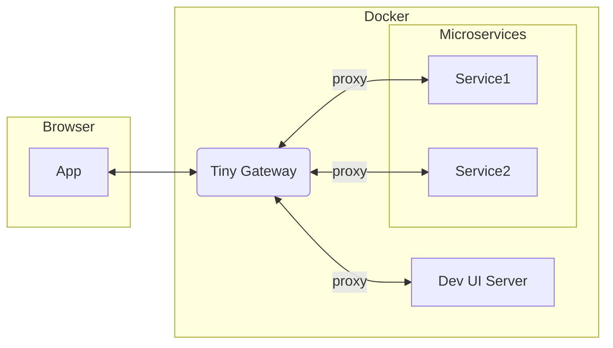

# Tiny Gateway

Tiny Gateway is a lightweight API gateway for multi-tenant development environments.
It handles authentication, role-based authorization for proxied routes, and forwards tenant context to backend services.



## Development-Only Use

This project is intended for development and testing environments, not production.

## Quick Start (Primary)

Run Tiny Gateway directly from GHCR with your own `config.yml`:

```bash
docker run --rm -p 8000:8000 \
  -e CONFIG_FILE=/app/config/config.yml \
  -v "/absolute/path/to/config.yml:/app/config/config.yml:ro" \
  ghcr.io/paul-callahan/tiny-gateway:latest
```

`/absolute/path/to/config.yml` is recommended, not required. A relative host path also works (resolved from your current shell directory), for example: `-v "./config.yml:/app/config/config.yml:ro"`.

Then verify:

```bash
curl http://localhost:8000/health
```

## Alternative: One Command Demo (Docker Compose)

This repo also ships a demo path by default:

- prebuilt image: `ghcr.io/paul-callahan/tiny-gateway:latest`
- default config: `sample-configs/basic-single-tenant.yml`
- demo upstream: `mock-backend` (from `docker-compose.yml`)

Run:

```bash
docker compose up
```

Login and test proxied route:

```bash
curl -X POST http://localhost:8000/api/v1/auth/login \
  -H 'Content-Type: application/x-www-form-urlencoded' \
  -d 'username=admin&password=admin123'

# Copy the access_token value from the response, then:
curl http://localhost:8000/api/service \
  -H "Authorization: Bearer <access_token>"
```

Stop:

```bash
docker compose down
```

## Use Your Own `config.yml` with Docker Compose

Point compose to your config file with one env var:

```bash
TINY_GATEWAY_CONFIG_FILE=/absolute/path/to/config.yml docker compose up
```

or put it in `.env` (see `.env.example`):

```env
TINY_GATEWAY_CONFIG_FILE=/absolute/path/to/config.yml
```

## Sample Configs

`sample-configs/` contains ready-to-use examples:

- `basic-single-tenant.yml`: single tenant + demo upstream
- `multi-tenant-rbac.yml`: multiple tenants with role-scoped access
- `path-rewrite.yml`: endpoint prefix rewrite example
- `multi-upstream.yml`: routes to multiple upstream services
- `wildcard-admin.yml`: broad wildcard permissions

## Why Tiny Gateway vs Traefik/NGINX?

Traefik and NGINX are excellent general-purpose reverse proxies.
Tiny Gateway focuses on a narrower problem: auth- and tenant-aware proxying for local/dev stacks with minimal setup.

What Tiny Gateway gives you out-of-the-box:

- login endpoint that issues JWTs from YAML-defined users
- tenant and role claims enforced on every proxied request
- tenant/role binding back to current config state
- direct RBAC mapping by HTTP method + resource
- automatic `X-Tenant-ID` forwarding upstream

If you already have a production-grade authn/authz stack, Traefik/NGINX + external identity policy is often the better fit.
If you want a single self-contained gateway for local dev teams, this project is optimized for that workflow.

## Configuration Schema

```yaml
tenants:
  - id: tenant-a
  - id: tenant-b

users:
  - name: alice
    password: pass123        # plaintext or bcrypt hash
    tenant_id: tenant-a
    roles: [editor]
  - name: bob
    password: pass456
    tenant_id: tenant-b
    roles: [viewer]

roles:
  editor:
    - resource: reports
      actions: [read, create, update]
  viewer:
    - resource: reports
      actions: [read]

proxy:
  - endpoint: /api/reports
    target: http://reports-api:9000/
    rewrite: ""
    change_origin: true
    resource: reports        # optional RBAC resource override
  - endpoint: /api/analytics
    target: http://analytics-api:9100/
    rewrite: "/v1"
    change_origin: true
    resource: reports
```

## Behavior Notes

### Proxy Matching and Rewrite

- matching is prefix-based (`proxy[].endpoint`)
- if multiple routes match, most-specific endpoint wins
- `rewrite: ""` preserves external endpoint prefix
- `rewrite: "/new-prefix"` replaces endpoint prefix
- `change_origin: true` rewrites `Host` header to upstream host

### RBAC Mapping for Proxied Requests

- `GET`, `HEAD`, `OPTIONS` -> `read`
- `POST` -> one of `create`, `write`, `execute`
- `PUT`, `PATCH` -> one of `update`, `write`
- `DELETE` -> one of `delete`, `write`

Permission matching:

- `resource: "*"` matches all resources
- action `"*"` matches all actions
- `proxy[].resource` is used when present
- otherwise resource is inferred from endpoint tail segment

### Tenant and Role Binding

For authenticated requests, token claims are re-validated against configured users:

- user (`sub`) must exist
- token `tenant_id` must match configured user tenant
- token roles must match configured user roles

## Startup Config Validation

Config is validated immediately at app startup.
If config has issues (missing file, invalid YAML, or schema/role/tenant errors), startup fails early with a clear error message including the config path and reason.

## API Endpoints

- `POST /api/v1/auth/login`
- `GET /api/v1/users/me`
- `GET /health`
- `GET /test_login`
- `GET /docs`

## Environment Variables

- `CONFIG_FILE`: config file path inside container/runtime
- `SECRET_KEY`: JWT signing key
- `ACCESS_TOKEN_EXPIRE_MINUTES`: token lifetime in minutes
- `LOG_LEVEL`: `DEBUG|INFO|WARNING|ERROR|CRITICAL`
- `HOST`: CLI host override
- `PORT`: CLI port override
- `RELOAD`: CLI reload toggle (`1`, `true`, `yes`)

Docker Compose helpers (in `.env.example`):

- `TINY_GATEWAY_IMAGE`
- `TINY_GATEWAY_PORT`
- `TINY_GATEWAY_CONFIG_FILE`
- `TINY_GATEWAY_CONFIG_PATH_IN_CONTAINER`
